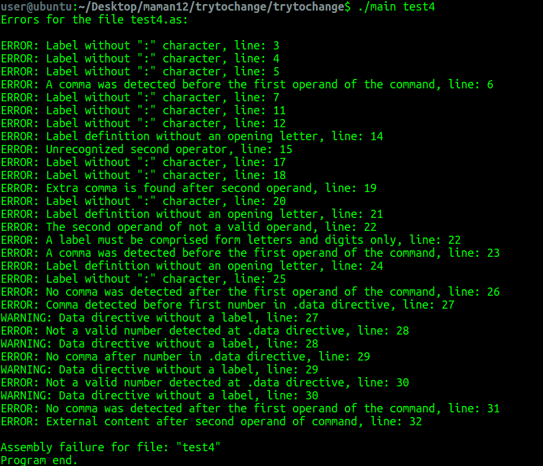
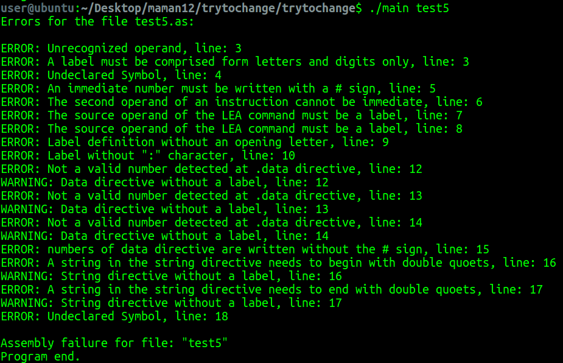

# Assembler
This assembler program translates instructions into binary machine code and then into unique binary code.

## Authors:
Ayala Zuriel 325606861
Chana Fuxbrumer 325030484

## General Info
Final project of the course 'Systems programming laboratory' in The Open University of Israel.

## Technologies
Project is created with ANSI C language on Ubuntu 16.04 operating system.

## Input files
Source file of instructions with extension ".as", for example ps.as.

## Output files
There are at most 4 output files:
* ".am" file of instructions after expanding macro statements.
* ".ob" file contains two columns table and in the head of the file the data and the istrucrion counter. First column contains the addresing of the word in the memory. Second column contains the machine code (in the uniqe representation) of the commands on the ".as" file.
* ".ext" optional file, created if only there are external labels defined in source file. Contains name of external label and it's decimal base address.
* ".ent" optional file, created if only there are entry labels defined in source file. Contains name of entry label and it's decimal base address.

## More details about running
Program can receive multiple ".as" files as an input, but will refer to each file separately.
If there is error in line of instruction, program will print error type into sterr file and continue execution. Line that contains an error will be ignored in further steps.  

## Machine code comand structure
 each machine code command is encoded to several memory words in the following format:
 
 
Bit  | 0  1 | 2  3 | 4  5 | 9  8  7  6 | 10  11 | 12  13|
------------ | -------------|------------ | -------------|------------ | -------------|------------ | 
Encoding | E,R,A | Destination operdand addresing | source operand addresing | opcode | parameter2 | parameter1

Finally the encoding will be translate into the uniqe binary base.
(instead '0' will be written '.' and instead '1' will be written '/').

### Bits 0-1 (A,R,E)
These determine the encoding type:
- 00 Absolute 
- 01: External
- 10 : Relocatable

These are aded only for instruction code encodings (not data encoding).

### Bits 2-3
These encode the number of the destination operand

### Bits 4-5
These encode the number of the source operand

### Bits 6-9
These encode the "opcode" of the instruction from the following table:

 Code (in base 10) | Action name
------------------- | -----------
0          |          mov
1          |         cmp
2          |         add
3          |          sub
4          |          not
5          |          clr
6          |          lea
7          |          inc
8          |          dec
9          |          jmp
10         |           bne
11         |           red
12         |           prn
13         |           jsr
14         |          rts
15         |           stop

### Bits 10-13
Relevant only if it is a jump addressing method, otherwise its value is 0. The bits characterize two parameters: bits 11-10 are responsible for parameter 2, and bits 12-13 are responsible for parameter 1.
If the parameter is an immediate number, the bits will get 00.
If the parameter is a register, the bits will get 11.
If the parameter is a label name, the bits will be set to 01

## Running steps
* Preprocessor: 

    Receives ".as" file and creates ".am" after expanding macro statements. At this step program doesn't check errors inside instructions.

* First step:

    Read, save instructions and their parameters, separate by type: command or directive (create symbol tables). Check different errors like typo's, wrong command names, wrong parameters etc.

* Second step: 

    Check label definitions and types. Handling possible errors in labels list (error for example: label is defined as entry and extern in the same source file). 
    
* Third step: 

    Keep track of location counter, translate instructions and output into files.

## Error types examples

### typo errors

### logic errors

